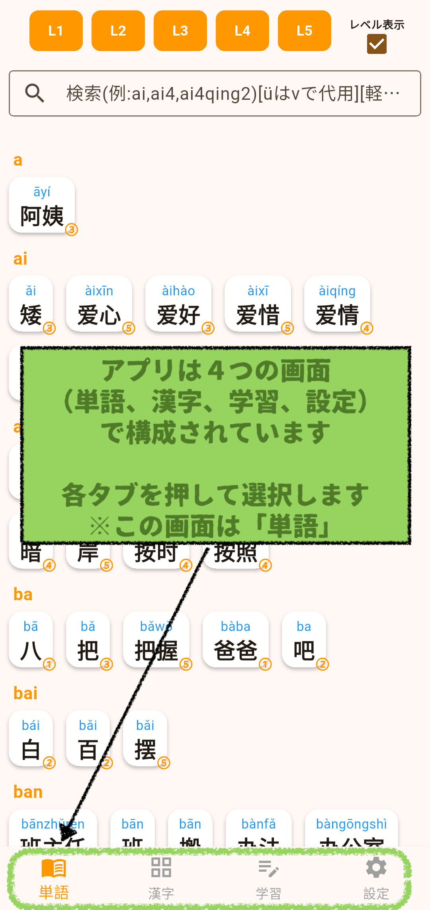
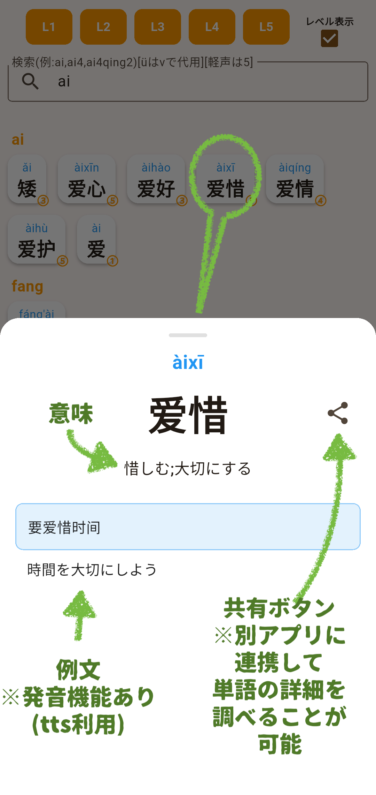
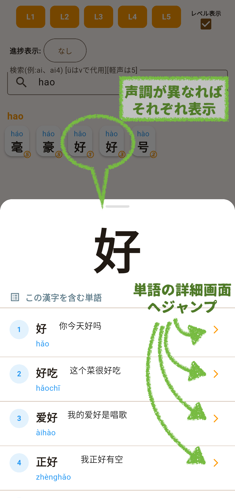
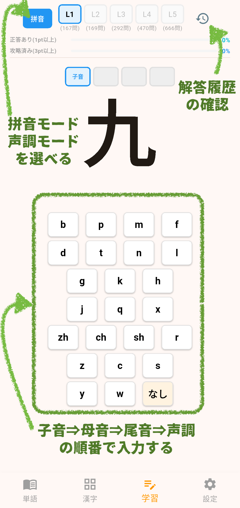
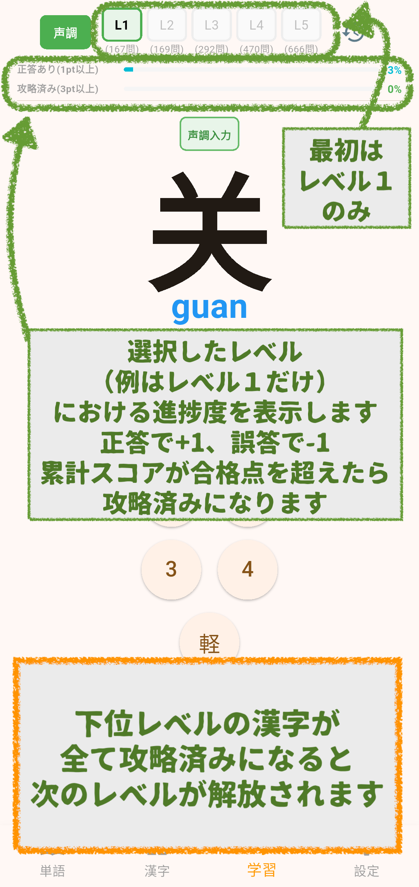
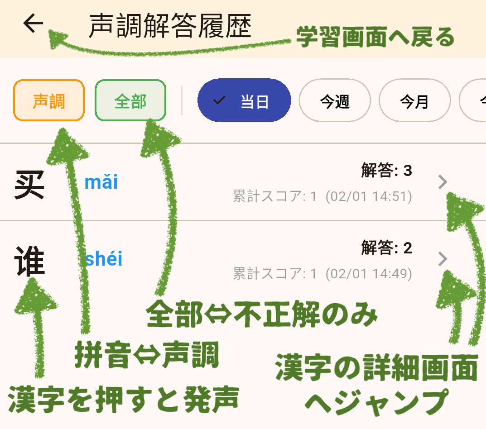

## アプリ概要
アプリ『拼読(ピンドク)』は中国語の単語・ピンイン・声調を学習するための学習アプリです。

- ４つの画面で構成  
 【単語】 中国語の単語一覧  
 【漢字】 単語に使われた漢字一覧  
 【学習】 漢字の声調とピンインのテスト  
 【設定】 各種設定と課金(広告非表示等)  
 

## 単語画面
- レベルやピンインで抽出可能  
 

- 単語をタップすると意味と例文を表示  
 

## 漢字画面
- レベルやピンインで抽出可能
- 漢字をタップすると漢字を含む単語一覧を表示  
 

## 学習画面
- ピンインまたは声調のテストを実施  
 

- 学習の進捗が確認できる  
 

- 履歴ボタンから過去の学習履歴を確認できます  
 

## 設定画面
- ピンイン・声調のテスト機能
- 中検・HSK対策にも対応

## サポート情報
- [プライバシーポリシー](docs/privacy.md)
- [お問い合わせ](https://forms.gle/ZELM35RPyfaAzeqk6)

---
© 2026 斎藤商店アプリ班