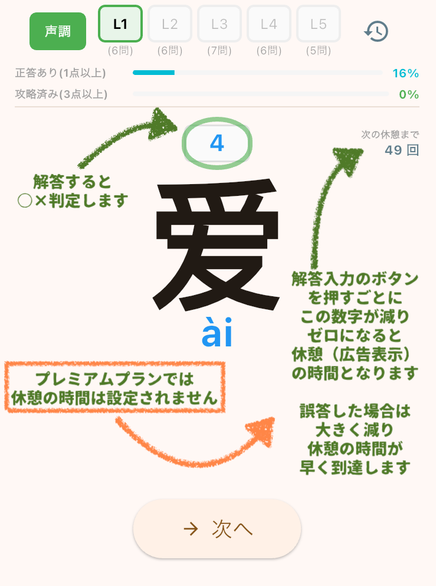
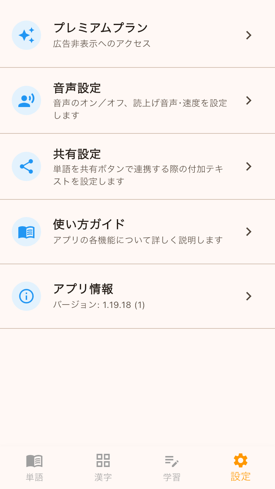
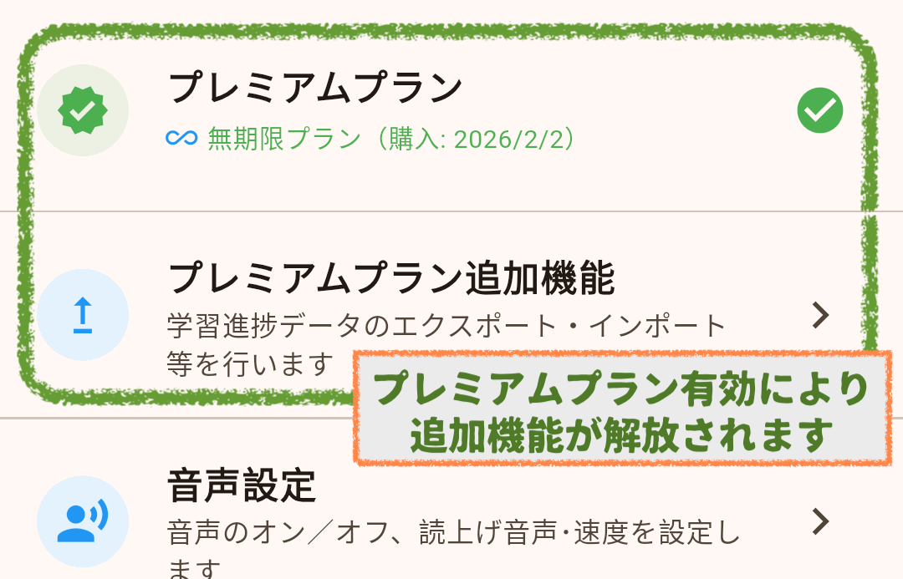

## アプリの概要
アプリ『拼読(ピンドク)』は中国語の単語・ピンイン・声調を学習するための学習アプリです。

- ４つの画面で構成されます  
 【単語】 中国語の単語一覧  
 【漢字】 単語に使われた漢字一覧  
 【学習】 漢字の声調とピンインのテスト  
 【設定】 各種設定と課金(広告非表示等)  
 

## 単語画面
- レベル(L1が最も簡単)やピンインで抽出可能です  
 

- 単語をタップすると、詳細画面で意味と例文を表示します  
 

## 漢字画面
- レベルやピンインで抽出可能です
- 漢字をタップすると漢字を含む単語一覧を表示します  
 

## 学習画面
- ピンインまたは声調のテストを実施します  
 
- 解答の正誤に応じて○×判定をします  
 
- 学習の進捗が確認できます  
 

- 履歴ボタンから過去の学習履歴を確認できます  
 

## 設定画面
プレミアムプランの購入や各種設定が出来ます  
&emsp;<!-- 全角スペース１つ分 -->

- プレミアムプラン  
  プレミアムプランにより広告が非表示となり、追加機能が解放されます  
    
  学習進捗データのエクスポート/インポートが可能となりますので、機種変更の際にご利用ください
  また、辞書ファイルのアップデート、合格基準点(初期設定:3点)の変更(2〜５点)が可能となります
- 音声設定  
  音声のオン/オフの他、スマートフォンの発声機能(tts)の声やスピードを調整できます
- 共有設定  
  単語の詳細画面で表示される「共有ボタン」で使う付加メッセージを変更できます
- 使い方ガイド  
  アプリの使い方の説明のほか、サポートページへのリンクがあります
- アプリ情報  
  アプリや辞書データのバージョン等が確認できます

## サポート情報
- [利用規約](docs/terms.md)
- [プライバシーポリシー](docs/privacy.md)
- [お問い合わせ](https://forms.gle/ZELM35RPyfaAzeqk6)

---
© 2026 斎藤商店アプリ班

※説明画像として開発段階のものを使用しており、実際の仕様とは細部が異なる場合があります。

