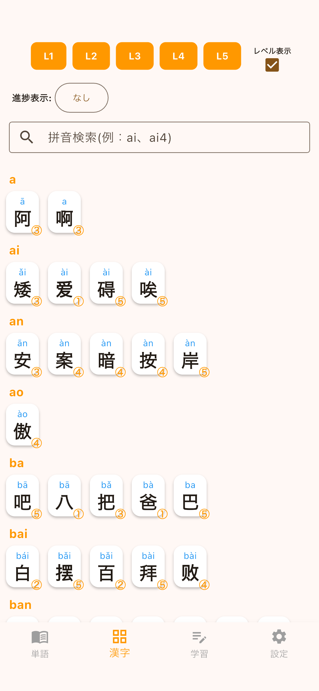

## アプリ概要
アプリ『拼読(ピンドク)』は中国語の単語・ピンイン・声調を学習するための学習アプリです。

- 漢字帳で漢字を一覧表示

    
- ピンイン・声調のテスト機能
- 中検・HSK対策にも対応

## サポート情報
- [プライバシーポリシー](docs/privacy.md)
- [お問い合わせ](https://forms.gle/ZELM35RPyfaAzeqk6)

---
© 2026 斎藤商店アプリ班